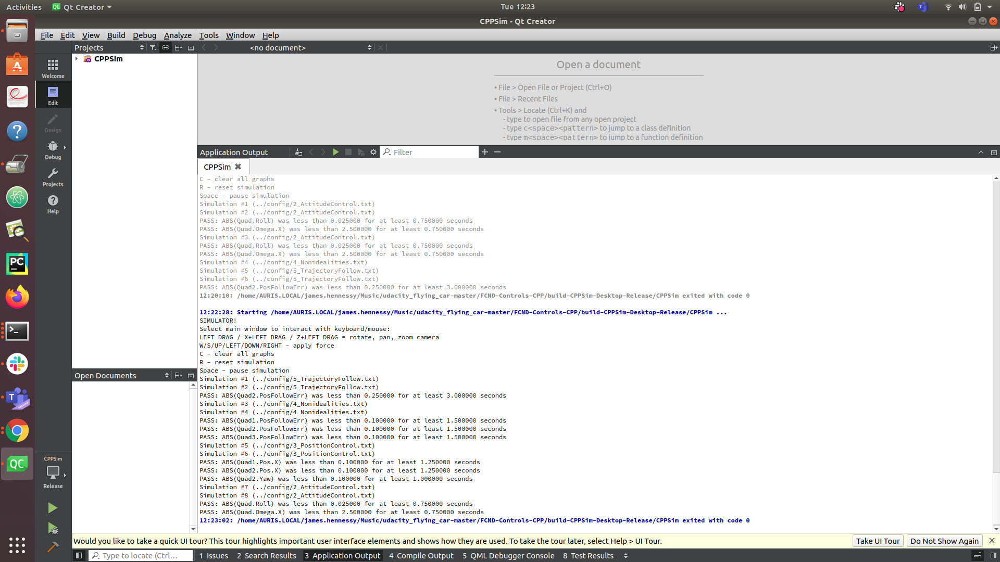
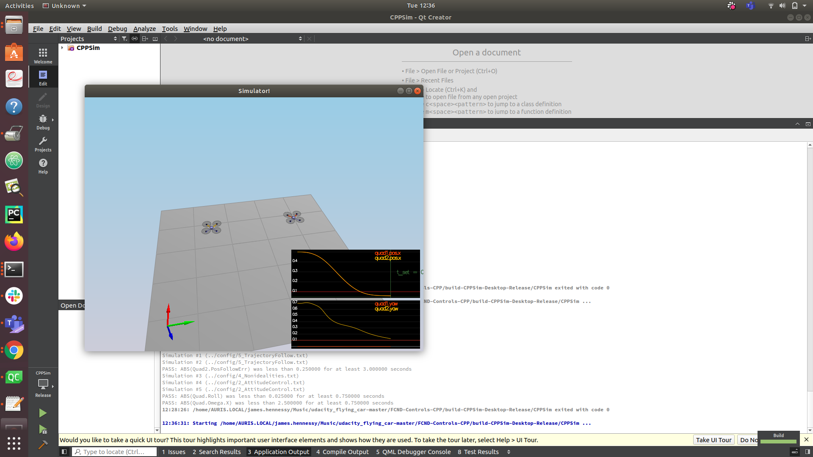
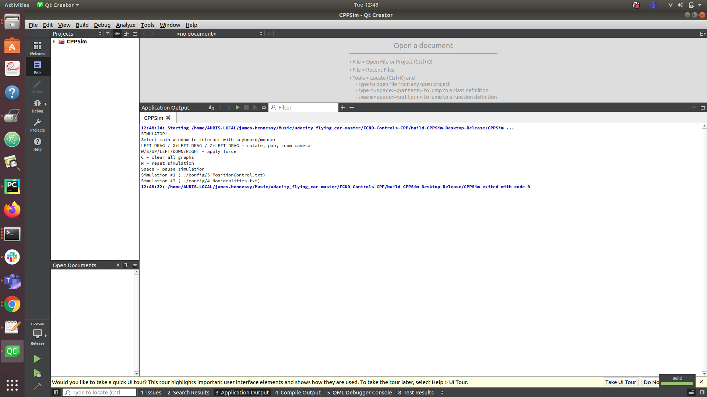
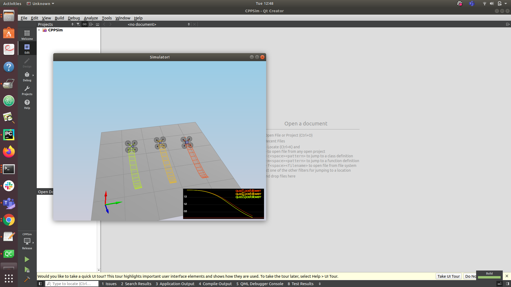
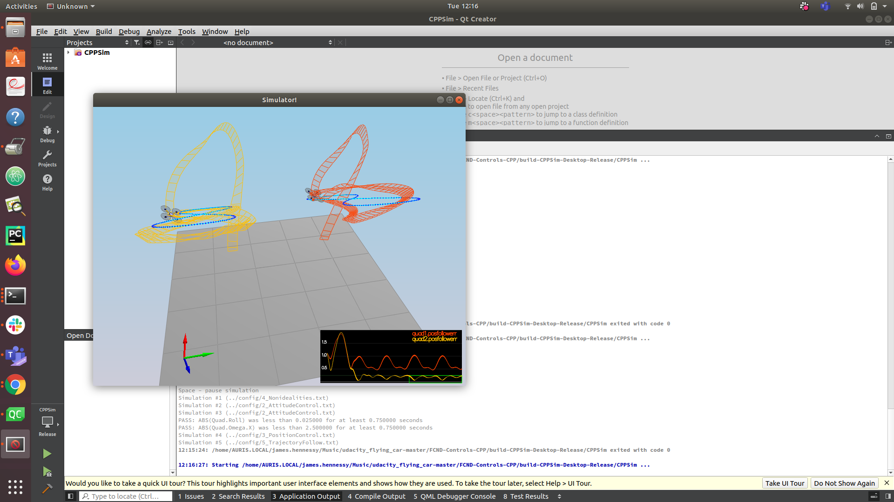
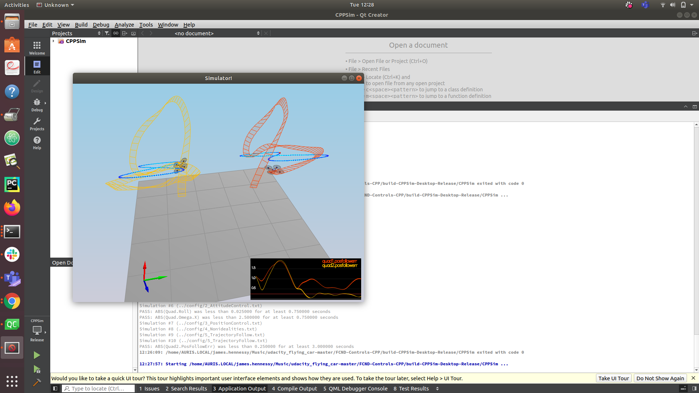

1.Generate Motor commands
 lines 72-82, get the four Taus of reactive moment  by the fou thrusts  by the order of the drag ratio, created vars and a thrust to track this <br\>
  float r = momentCmd.z / (kappa * 4.f);<br\>
  float var_root_two = L / sqrtf(2.f);
  float q = momentCmd.x / (var_root_two * 4.f);
  float c = collThrustCmd / 4.f;
  float b = momentCmd.y / (var_root_two * 4.f);

  cmd.desiredThrustsN[2] = c + b - q - r; 
  cmd.desiredThrustsN[0] = c + b + q + r; 
  cmd.desiredThrustsN[1] = c - b + q - r; 
 
  cmd.desiredThrustsN[3] = c - b - q + r;
2. Body rate Control
Lines 124 to 132  its the angular accleration around the x,yz, axis times the moment of interation, to get the tau of the resulting moment

  V3F I_moment;
  I_moment.x = Ixx;
  I_moment.y = Iyy;
  I_moment.z = Izz;

3. PITCH ROLL 
lines 144-158  , get the body rate around the x and y axis as scalrs and feed that to the body rate control. Based around the R rotation matrix of the altiude of the drone. Check if coll thrust is too much.
 
  float target_beta_x_thurst = 0.0;
  float target_beta_y_thurst = 0.0;
  if (collThrustCmd > 0.0)
  {
      float c = collThrustCmd/mass;
      target_beta_x_thurst = -CONSTRAIN(accelCmd.x/c, -maxTiltAngle, maxTiltAngle);
      target_beta_y_thurst = -CONSTRAIN(accelCmd.y/c, -maxTiltAngle, maxTiltAngle);
  }
  float Y_var = target_beta_y_thurst - R(1, 2);
  float X_var = target_beta_x_thurst - R(0, 2);

  pqrCmd.y = kpBank *((R(1, 1) * X_var) - (R(0, 1) * Y_var)) / R(2, 2);
  pqrCmd.x = kpBank *((R(1, 0) * X_var) - (R(0, 0) * Y_var)) / R(2, 2);

  pqrCmd.z = 0.f;
4. Altitude control
Lines 188-194, get the  Force of the thurt basd on the zaxis of the interial frame , and control gain parameters
 
 
  float error_z = posZCmd - posZ;
  integratedAltitudeError += error_z * dt;

  float velocity_z_loc = velZCmd + (kpPosZ * error_z) + (KiPosZ * integratedAltitudeError);
  velocity_z_loc = -CONSTRAIN(-velocity_z_loc, -maxDescentRate, maxAscentRate);
  float accel_toal = accelZCmd + (kpVelZ*(velocity_z_loc - velZ));
  thrust = mass * (9.81f - (accel_toal / R(2,2)));
 

5.Lateral postion 
Lines 230-235 , like Altidue control but for along the x and y  axis frame.

 
  velCmd.constrain(-maxSpeedXY,maxSpeedXY);
  V3F postion_error_mes = posCmd - pos;
  V3F error_rate_vel = velCmd - vel;
  accelCmd =  (kpPosXY * postion_error_mes)+accelCmdFF + (kpVelXY * error_rate_vel);
  accelCmd.constrain(-maxAccelXY,maxAccelXY);
  accelCmd.z = 0;

6. Yaw
Lines 256-267, get the angular velocity around the z axis , not impacted by roll or pitch so applied last and analyzled seperatley .
 
  float yaw_var = fmod(yawCmd, (2.0f*F_PI));

  if (yaw_var <= -F_PI)
  {
     yaw_var += (2.0f*F_PI);
  }
  else if (yaw_var > F_PI)
  {
     yaw_var -= (2.0f*F_PI);
  }

  yawRateCmd = kpYaw * (yaw_var - yaw);
 

7. figure 8

